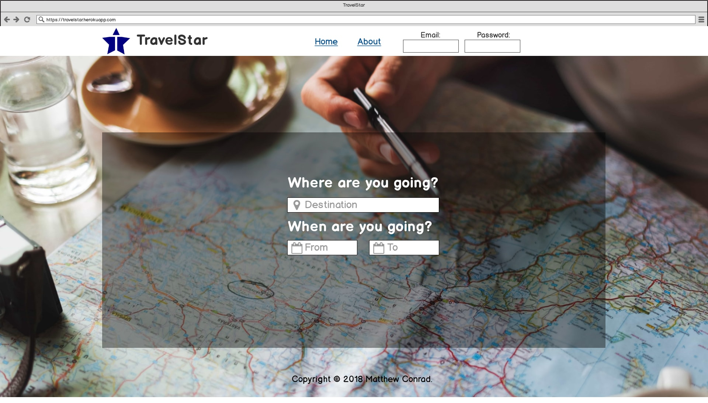

# TravelStar


Search top ten attractions, top twenty activities, dining options, and photos of different locations around the world.
## Under the Hood
Made with :coffee: and Visual Studio Code in a Linux OS.
## To Set Up Locally
You can take all the files of this site and run them on your computer as if it were live online, only it's just on your machine. This project uses the [Sygic](https://travel.sygic.com/en/b2b) API to retrieve data about certain places around the world.
### Requirements
* [Git](http://git-scm.com/)
* [Composer](https://getcomposer.org/)
* [Homestead](https://laravel.com/docs/5.6/homestead)
* [Laravel 5.6](https://laravel.com/)
To copy the repository's files from here onto your computer and to view and serve those files locally, at your computer's command line type:
```
git clone https://github.com/matthew-conrad/travelstar.git
```
Open the files in a text editor such as [Visual Studio Code](https://code.visualstudio.com/) and, if you have access to [Bash](https://en.wikipedia.org/wiki/Bash_(Unix_shell)), in the terminal type:
```bash
php composer.phar install
php composer.phar update
```
After installing Homestead, launch the Vagrant VM from within the Homestead directory in the terminal with:
```bash
vagrant up
```
You'll also need to create a *config.js* file in the public/js directory containing the Sygic API Key:
```javascript
const config = {
  KEY : "api_key"
};
```
If everything went well, you should be able to visit *travelstar.test* in the browser.
## License
TravelStar is licensed under the [MIT license](https://github.com/matthew-conrad/travelstar/blob/master/LICENSE).
## View Project
[TravelStar | Your Destination for Travel Information](https://travelstar.herokuapp.com)